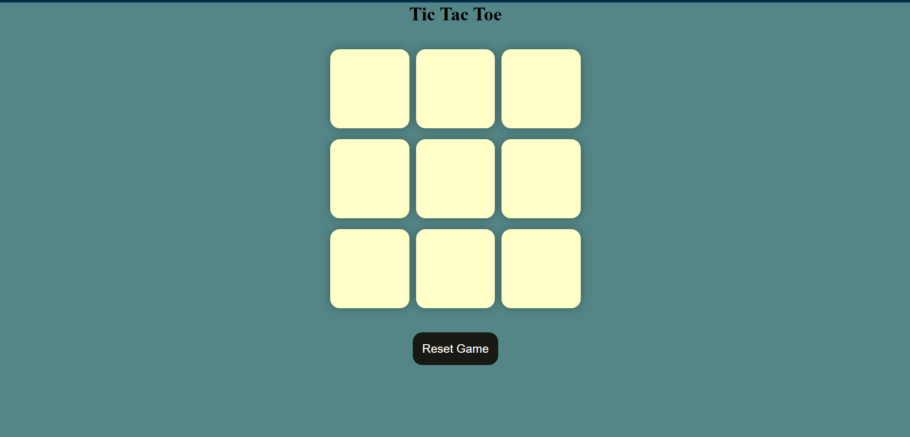

# 🎮 Tic Tac Toe

A simple and interactive **Tic Tac Toe** game built using **HTML**, **CSS**, and **JavaScript**.  
Perfect for two players and ideal for learning the basics of front-end web development.

---

## 🚀 Live Demo

Play it here: (https://prashant-pal23.github.io/-Tic-Tac-Toe/)

---

## 📌 Features

- ✅ Two-player mode (X and O)
- ✅ Displays the winner or draw message
- ✅ "Reset Game" and "New Game" buttons
- ✅ Responsive and clean UI design
- ✅ Colorful highlights for player moves

---

## 🛠️ Technologies Used

- **HTML** – Structure of the page  
- **CSS** – Styling and layout  
- **JavaScript (ES6)** – Game logic and interactivity

---

## 📸 Screenshot

---

## 📁 Project Structure

tic-tac-toe/
├── index.html # HTML structure
├── style.css # Styling
├── script.js # Game logic
├── screenshot.png # Game preview image
└── README.md # Project documentation

---

## 💡 How to Play

1. Click on any empty square to make a move.
2. Player O starts the game.
3. The first player to get 3 in a row (vertically, horizontally, or diagonally) wins!
4. Use the **Reset Game** or **New Game** buttons to start over.

---

## 📬 Connect

If you liked this project, consider starring 🌟 the repo or [connecting with me](https://github.com/Prashant-Pal23)!

---
